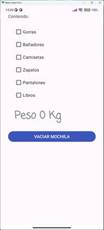
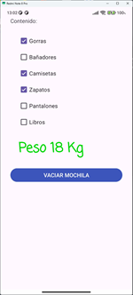
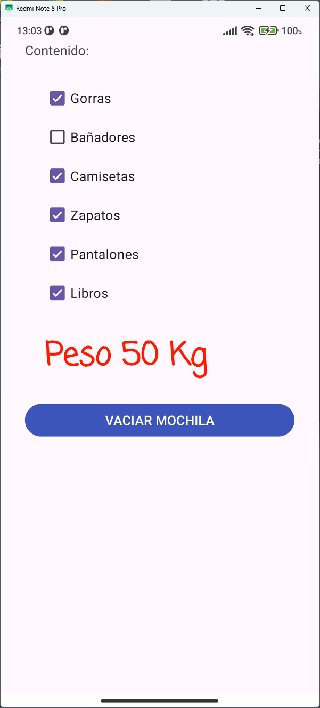

# Llenamos la mochila

Esta es una app Android sencilla que permite mostrar un mensaje según las opciones seleccionadas.

## 📱 Interfaz de Usuario (UI)

- **Padding general:** Todos los componentes están a 30dp hacia el interior.
- `TextView` con texto "Contenido:" y tamaño de fuente 20sp.
- **Grupo de radios de contenido:**
  - `CheckBox` con texto "Gorras" (Opción por defecto).
  - `CheckBox` con texto "Bañadores".
  - `CheckBox` con texto "Camisetas".
  - `CheckBox` con texto "Zapatos".
  - `CheckBox` con texto "Pantalones".
  - `CheckBox` con texto "Libros".
- **Texto de peso:**`.
  - `TextView` con fuente "casual" y tamaño de fuente 34sp.
- **Botón de vaciar:**
  - `Button` con texto "VACIAR MOCHILA".
  - Fondo azul claro.

## ⚙️ Funcionalidad

- Al pulsar sobre cualquier `CheckBox`, se calcula el peso total de la mochila y se muestra en el `TextView`.
- Los pesos de cada objeto son respectivamente {1, 5, 7, 10, 15, 17}.
- El peso máximo que soporta la mochila es 35 Kg.
- Si el peso total es 0, se muestra en gris.
- Si el peso total está entre 0 y 35, se muestra en verde.
- Si el peso total es mayor que 35, se muestra en rojo.
- Al pulsar el botón **VACIAR MOCHILA**, todos los `CheckBox` se deseleccionan.

## 🛠️ Tecnologías usadas

- Android Studio
- Java
- XML (para layouts)
- API mínima: 28+ (Android 8.1)

## 📂 Estructura del proyecto

```
/app/src/main/java/.../MainActivity.java (funcionalidad básica)
/app/src/main/res/layout/activity_main.xml
```

## 📸 Capturas de pantalla

### Pantalla principal



### Selección de objetos con peso válido



### Selección de objetos con peso no válido



## 📄 Licencia

Este proyecto es de uso educativo y puede modificarse libremente.